<div align="center">

<picture>
  <source media="(prefers-color-scheme: dark)" srcset="docs/media/banner-dark.png">
  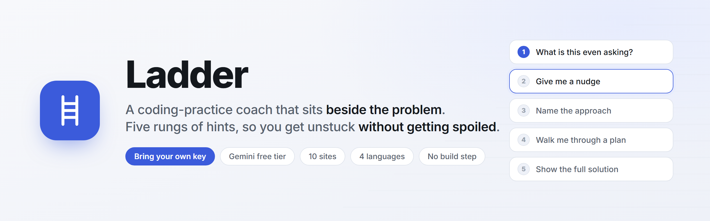
</picture>

<br>

**A Chrome extension that coaches you through LeetCode, Codeforces and AtCoder — instead of handing you the answer.**

[](https://github.com/erichuang1425/ladder/actions/workflows/test.yml)
[](manifest.json)
[](#development)
[](#languages)
[](LICENSE)

[Install](#install-in-30-seconds) · [Get a free key](#get-a-key) · [Languages](#languages) · [Privacy](#where-your-data-goes) · [Development](#development)

</div>

---

## The problem with asking an AI for help

You get stuck, you paste the problem into a chatbot, and it hands you a working
solution in three seconds. You understood nothing, and next week the same
pattern shows up in a different costume and you're stuck again.

Ladder makes that hard on purpose. Help arrives in **five rungs**, and each rung
is written to refuse to give away the one above it.

<div align="center">
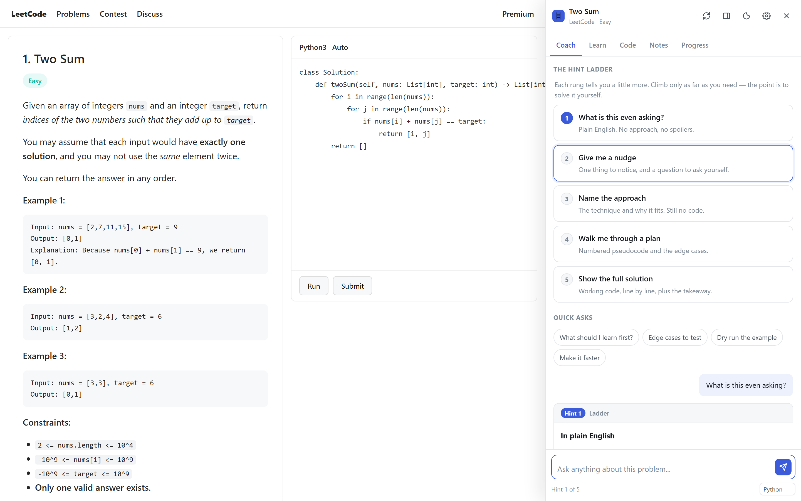
</div>

|  | Rung | What you get | What it refuses |
|:--|:--|:--|:--|
| **1** | What is this even asking? | The problem in plain English, one example worked by hand | Any algorithm name, any approach |
| **2** | Give me a nudge | One observation, two questions to ask yourself | Naming the technique, complexity |
| **3** | Name the approach | The technique, why it fits, what it costs | Pseudocode, real code |
| **4** | Walk me through a plan | Numbered pseudocode, state to track, edge cases | Syntactically valid code |
| **5** | Show the full solution | Working code, walked line by line, plus the takeaway | — |

You climb only as far as you need. Skipping rungs asks you to confirm first, and
level 5 arrives blurred so your eyes can't land on it by accident.

<div align="center">
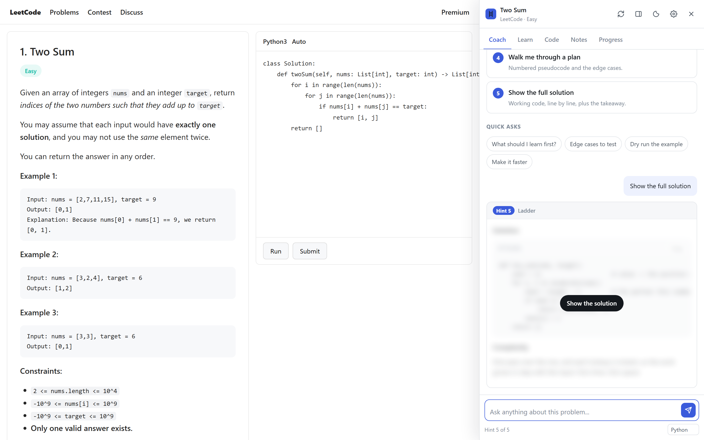
</div>

---

## Built for people starting from zero

Most tools assume you already know what a hash map is. Ladder assumes you don't.

**Beginner mode** (on by default) forbids "simply", "just" and "obviously",
requires every term to be defined the first time it's used, and never writes
`O(n log n)` without saying what it means in words.

**The Learn tab** scans the problem statement for the ~50 terms it quietly
assumed you knew, and explains each one in plain language — **with no API key at
all**. The term keeps its English name, because that's the word you'll meet in
the next problem and the word you'd have to search for.

<div align="center">
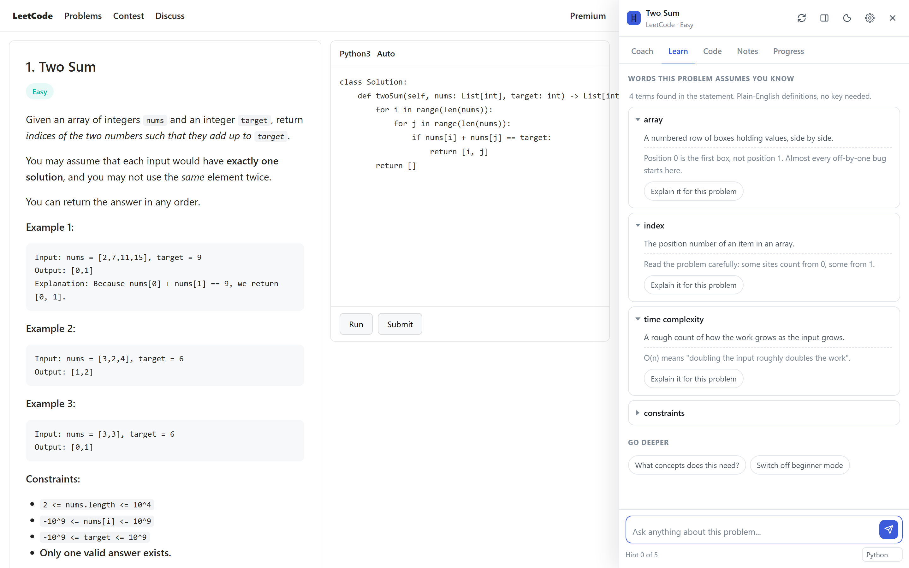
</div>

---

## What else is in there

<table>
<tr>
<td width="50%" valign="top">

**Review your code, not replace it**

Paste your attempt and Ladder points at the offending line and says what it
does versus what it should do. It won't paste a corrected solution unless you
ask for one.

Also: *why is it failing?*, *make it faster*, and a step-by-step trace of your
code against the sample input.

</td>
<td width="50%" valign="top">

**Spaced repetition, built in**

Mark a problem solved and it comes back after 1, 3, 7, 16 and 35 days. The
Progress tab tracks a streak, and Notes gives you a scratchpad per problem for
writing the insight in your own words.

</td>
</tr>
<tr>
<td width="50%" valign="top">

**Sits beside the page, not over it**

The panel docks and pushes the page across, or floats if you prefer. Drag the
edge to resize. Light and dark. `Ctrl+Shift+L` to toggle, `Ctrl+Shift+H` for
the next hint.

</td>
<td width="50%" valign="top">

**Ten sites, and everywhere else too**

Purpose-written extractors for LeetCode, Codeforces, AtCoder, HackerRank,
CodeChef, CSES, Kattis, SPOJ, Exercism and HackerEarth. Anywhere else it falls
back to finding the problem-shaped text on the page.

</td>
</tr>
</table>

<div align="center">
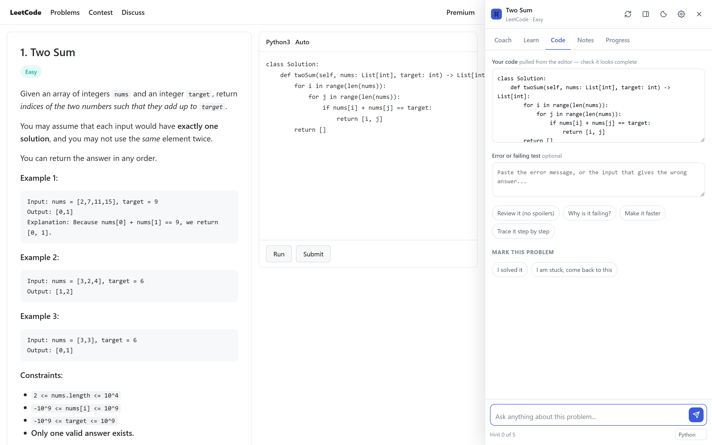
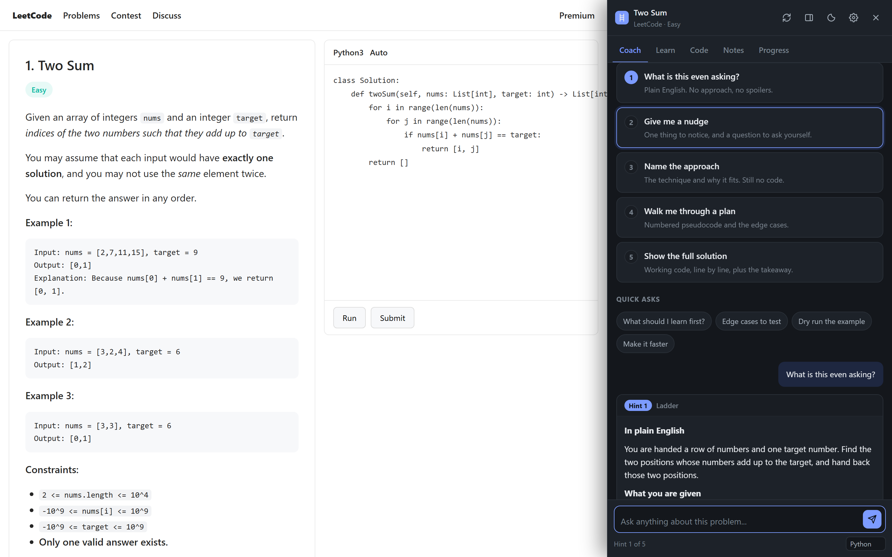
<br>
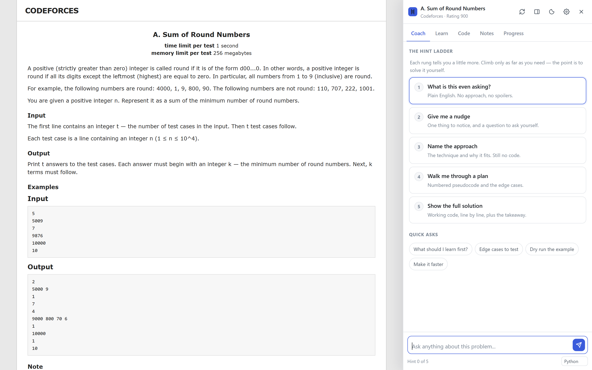
</div>

---

## Install in 30 seconds

No build step, no dependencies, no server. It runs from source as it is.

```bash
git clone https://github.com/erichuang1425/ladder.git
```

1. Open `chrome://extensions`
2. Turn on **Developer mode** (top right)
3. Click **Load unpacked** and pick the folder you just cloned
4. The settings page opens by itself

## Get a key

Ladder has no server and no account. Your key goes straight from your browser to
whichever provider you picked, and never touches anything of mine.

**The free route:** open [Google AI Studio](https://aistudio.google.com/apikey),
sign in with any Google account, click *Create API key*, and paste it into the
box at the top of Ladder's settings. No credit card.

You don't need to know which provider a key belongs to — paste it and Ladder
works it out from its shape, saves it, and tests it live.

<div align="center">
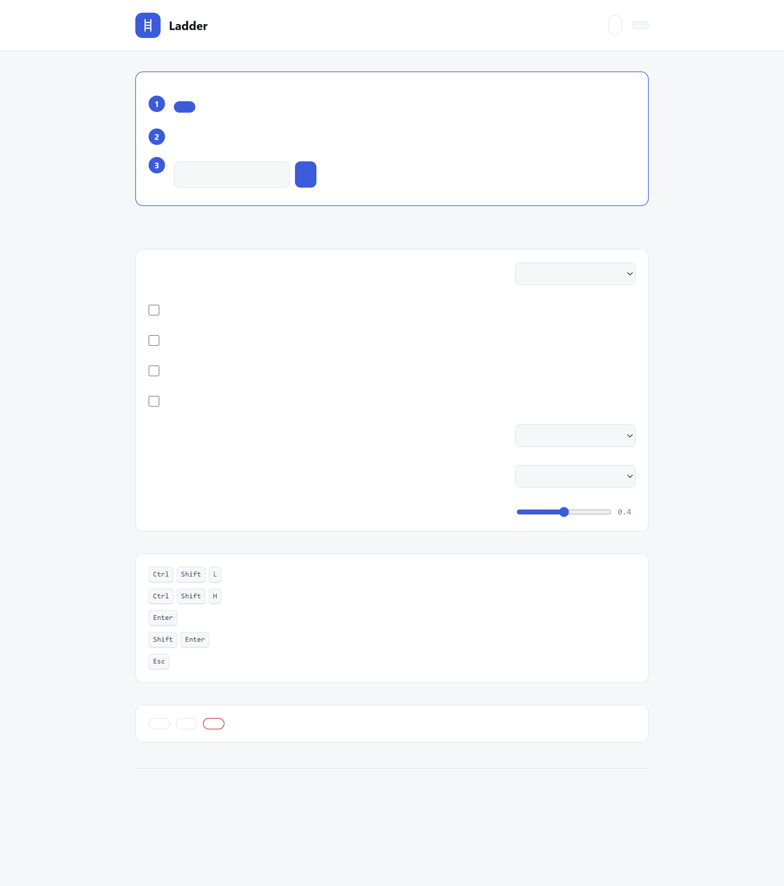
</div>

<details>
<summary><b>All twelve providers</b></summary>

<br>

| Provider | Free tier | Key looks like |
|---|:--:|---|
| Google Gemini | ✅ | `AIza…` |
| Groq | ✅ | `gsk_…` |
| OpenRouter | ✅ some models | `sk-or-v1-…` |
| Cerebras | ✅ | `csk-…` |
| Mistral | ✅ | 32 characters |
| OpenAI | — | `sk-…` |
| Anthropic | — | `sk-ant-…` |
| DeepSeek | — | `sk-…` (32 hex) |
| xAI Grok | — | `xai-…` |
| Together AI | — | 64 hex characters |
| **Ollama**, on your own machine | ✅ offline | no key at all |
| Anything OpenAI-compatible | — | you set the base URL |

For Ollama, start it so the extension is allowed to connect:

```bash
OLLAMA_ORIGINS=* ollama serve
```

</details>

---

## Languages

Ladder ships in **English, Traditional Chinese, Simplified Chinese and Spanish** —
the interface, the glossary, and the language the model answers in.

It follows your browser by default. The picker names every language in its own
script, so you can find yours whatever the UI currently shows.

<div align="center">
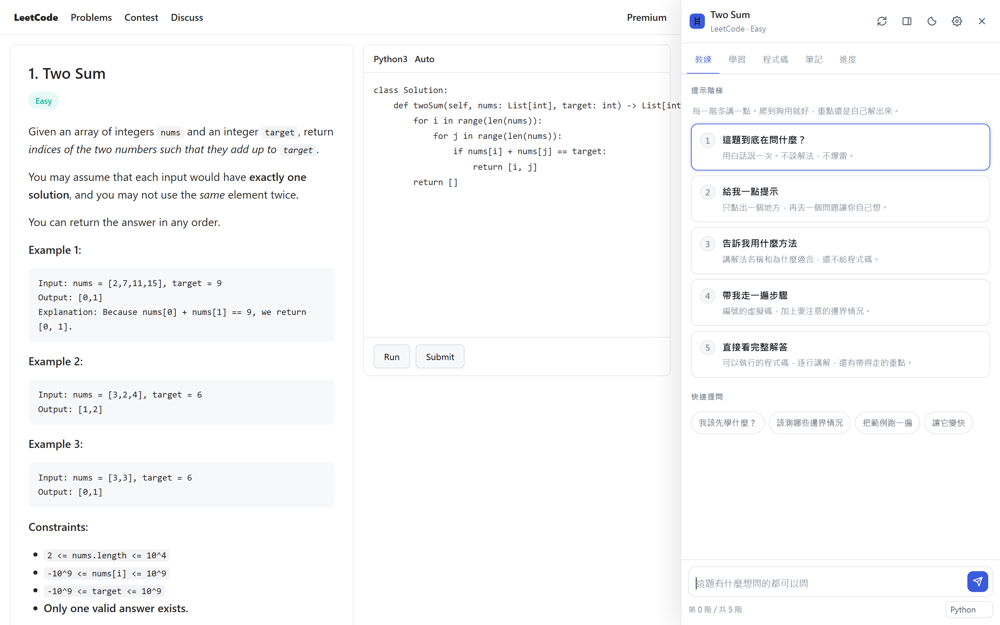
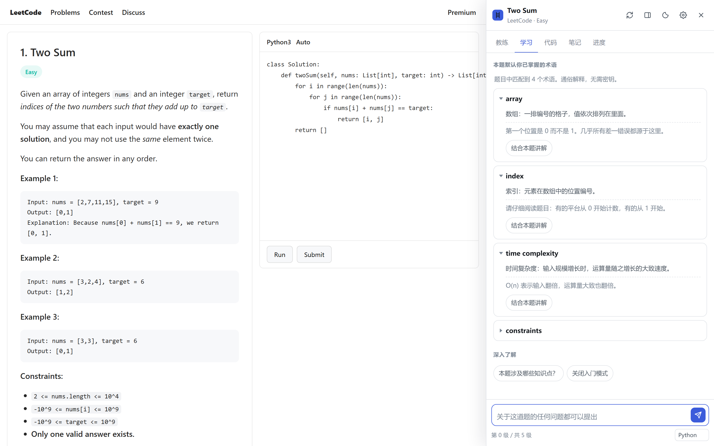
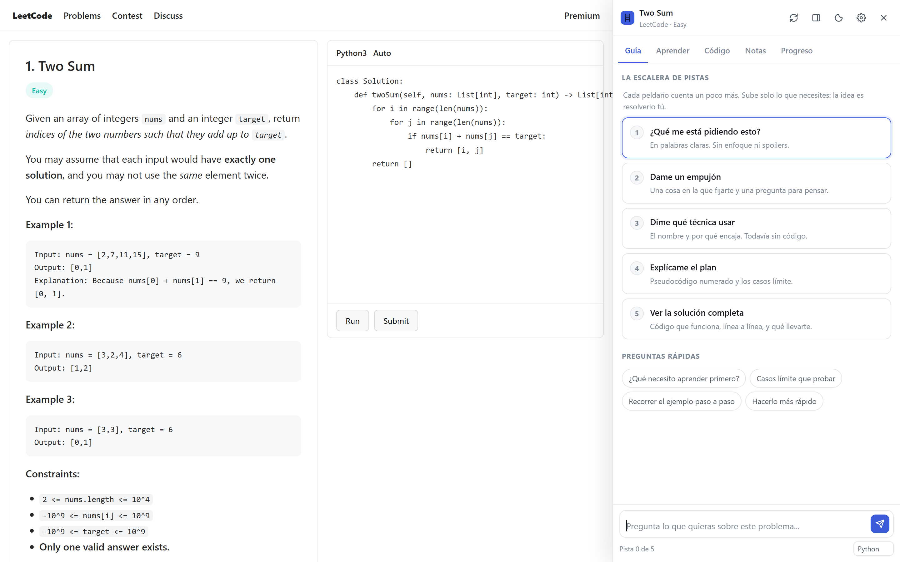
<br><sub>繁體中文 · 简体中文 · Español — click any image to enlarge</sub>
</div>

The two Chinese locales are written independently, not converted from each
other — `陣列 / 堆疊 / 遞迴 / 程式碼` in Traditional against
`数组 / 栈 / 递归 / 代码` in Simplified. A test asserts neither contains the
other's forms.

Code, identifiers and notation like `O(n log n)` always stay in English, and
algorithm names keep their English form with a gloss on first use — so you learn
the term you'll actually have to search for.

> [!NOTE]
> Browsers reporting `zh-HK` or `zh-MO` get the Traditional dictionary. It is
> Taiwan-register Mandarin, so Hong Kong readers will meet some vocabulary they
> would write differently. A dedicated `zh-HK` locale is a drop-in addition —
> [open an issue](../../issues) if you want it.

---

## Where your data goes

- Keys, notes and progress live in `chrome.storage.local`, in your browser profile only.
- **There is no server.** No account, no telemetry, no analytics.
- Network requests go only to the provider you configured. Every one of them is made
  by the service worker — **the content script running on the page never sees your key**.
- Exported progress files deliberately leave the keys out.
- The problem statement, and your code if you enable that, are sent to your provider as
  part of a request. Nothing else is.
- Permissions: `storage`, `scripting`, `activeTab`, and host access limited to the
  provider API endpoints. Custom endpoints are requested at runtime, when you add one.

---

## Development

```bash
node tools/selftest.js
```

56 checks, no test framework and no dependencies. They cover the markdown
renderer's escaping (model output can't inject markup), glossary matching,
request building for every provider, key detection, prompt assembly with
hint-level containment asserted, the SSE parsers for all three wire formats
(including chunks split mid-line, malformed JSON and CRLF), and translation
coverage — every locale defines every key, placeholders match, nothing is left
untranslated, and locale tags resolve correctly.

```bash
node tools/serve.js 5178
```

Serves fixture pages that run the **real** content scripts against realistic
problem markup with the extension APIs faked, so the panel can be driven without
packing anything:

- <http://localhost:5178/tools/fixture/leetcode.html>
- <http://localhost:5178/tools/fixture/codeforces.html>

In the fixture, `__ladderTest.adapters()` reports what every site adapter
extracts from the page, `__ladderTest.lang('zh-TW')` switches language through
the real settings path, and `__ladderTest.reset()` clears stored state.

```bash
node tools/shots.js      # re-render every screenshot in this README
node tools/make-icons.js # regenerate the icon PNGs
```

Both drive real rendering — the screenshots come from headless Chrome against
the live UI, and the icons are written as raw PNG bytes with no image library.

<details>
<summary><b>Layout</b></summary>

<br>

```
manifest.json
src/
  background.js        service worker: every network call, SSE parsing, commands
  shared/
    constants.js       storage schema, hint levels, spaced-repetition intervals
    providers.js       provider registry, request building, key detection
    prompts.js         the hint ladder itself: what each rung may and may not say
    markdown.js        escape-first markdown renderer
    glossary.js        49 terms, offline, no key required
    i18n.js            translation engine, locale resolution, CJK font stacks
    locales/           en, zh-TW, zh-CN, es — 360 keys each
  content/
    adapters.js        per-site problem extraction with structural fallbacks
    panel.js           the panel, in a shadow root
    panel.css
  options/             settings and API keys
  popup/               toolbar popup
_locales/              extension name and description, for the store listing
tools/                 tests, fixtures, screenshots, icons, dev server
docs/media/            the images in this README
```

The interesting file is [`src/shared/prompts.js`](src/shared/prompts.js). The
hint ladder only works if each rung genuinely refuses to give away the rung
above it, and that refusal is written there, per level, as an explicit list of
what is forbidden at that level.

</details>

---

## Contributing

Issues and pull requests are welcome. Useful places to start:

- **A site adapter.** Each one is ~20 lines in
  [`src/content/adapters.js`](src/content/adapters.js): a hostname test, a title,
  a difficulty, and a statement selector with fallbacks.
- **A locale.** Copy [`src/shared/locales/en.js`](src/shared/locales/en.js),
  translate the values, register it in `i18n.js`. The self-test will tell you
  exactly what you missed.
- **A provider.** Add an entry to
  [`src/shared/providers.js`](src/shared/providers.js) — most speak the
  OpenAI-compatible wire format already.

Please run `node tools/selftest.js` before opening a PR. CI runs the same thing.

## Status

Early. It works and it's tested, but it has not been through a Chrome Web Store
review, and the site adapters are verified against realistic fixtures rather
than a live scrape — selectors on these sites change, which is why every adapter
falls back to a structural heuristic. If one breaks, that's a good issue to file.

## License

[MIT](LICENSE) © I-Kai Huang

<div align="center">
<br>
<i>The ladder only helps if you climb it slowly.<br>Every rung you skip is a rep you didn't do.</i>
</div>
